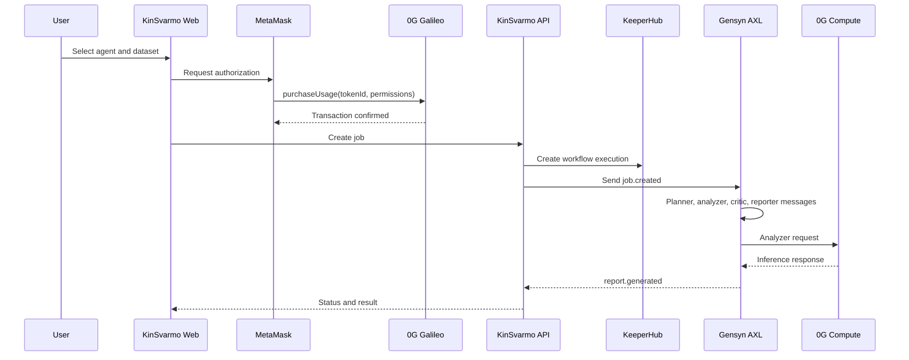
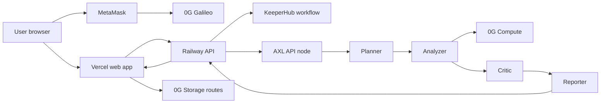
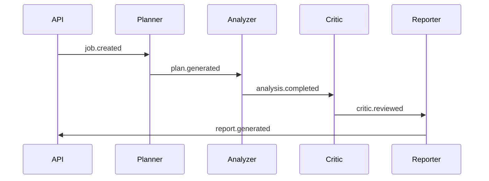
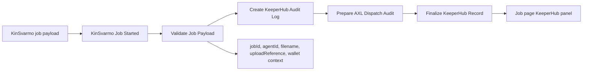
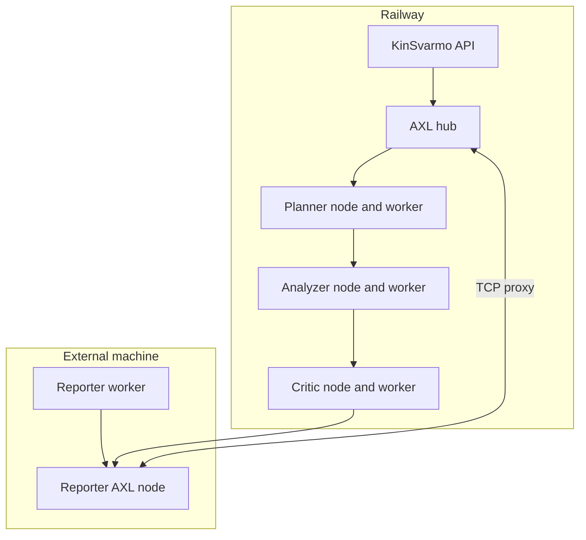

# KinSvarmo

KinSvarmo is an execution application for reusable analysis agents. A creator publishes an agent with a domain, prompt, expected input type, price, and storage references. A user selects an agent, authorizes one run on 0G Galileo, submits a dataset, and receives a report with the execution trail attached.

The project combines four execution layers around one job ID:

1. 0G handles wallet authorization, agent references, dataset references, and compute.
2. Gensyn AXL carries the agent-to-agent workflow messages.
3. KeeperHub records the backend workflow execution.
4. KinSvarmo displays the job state, AXL messages, KeeperHub record, 0G compute metadata, and final result.

This structure is generic. The current application shows scientific and classroom-style workflows, but the same pattern can represent lab intake, internal review, legal document analysis, compliance checks, benchmark submissions, or any workflow where a dataset should be processed by a specific agent under a visible execution path.

## Entry Points

Landing page:

```text
https://kinsvarmoui.vercel.app/
```

Application:

```text
https://kinsvarmo-app.vercel.app
```

Documentation:

```text
https://kinsvarmo-docs.vercel.app/guide/getting-started.html
```

API:

```text
https://kingsvarmoapi-production.up.railway.app
```

## Product Modes

Marketplace mode is the direct run flow. A user browses agents, opens an agent detail page, connects a wallet, authorizes the run, submits a dataset, and tracks the job until the result is ready.

Workspace mode is the repeated-submission flow. A coordinator creates a reusable work item around an agent, shares a submission page, and reviews submitted runs through the same job and result pipeline. The workspace concept is intentionally generic. It can represent a class assignment, lab queue, review batch, or internal benchmark.

Both modes use the same execution system. A run still creates a job, records the KeeperHub workflow, sends AXL messages between agents, calls 0G Compute when configured, and produces a final result object.

## Runtime Flow




## System Architecture




## Technology Roles

### 0G

0G provides the chain, storage, and compute components.

The chain step is the usage authorization. The user confirms a 0G Galileo transaction before the backend workflow starts. The current registry address is:

```text
0xD89CF7E93B95370a9c4DbCbeDD596eb36386ed86
```

0G Storage is used for dataset and metadata references. The application displays these references as `0g://...` values.

0G Compute is used by the analyzer step. The result object stores the provider address, model, service URL, chat completion ID, usage metadata when returned, and the raw provider response.

### Gensyn AXL

AXL is used for the agent communication path. The job is split across five participants:

```text
api
planner
analyzer
critic
reporter
```

The completed workflow has five AXL messages:




The job page displays this message history. The topology endpoint displays the connected AXL peers:

```text
https://kingsvarmoapi-production.up.railway.app/api/axl/topology
```

### KeeperHub

KeeperHub receives the backend job payload and records the workflow execution. The payload includes the job ID, agent ID, filename, upload reference, and wallet context.

The KeeperHub workflow records:

```text
Job payload received
Payload fields validated
KeeperHub audit log created
AXL dispatch recorded
Workflow record finalized
```

Current KeeperHub workflow:



The job page displays the KeeperHub execution ID, workflow ID, node statuses, recent logs, and workflow trace.

### Railway

Railway runs the production API service, hosted AXL nodes, and hosted workers. The hosted AXL participants are:

```text
api
planner
analyzer
critic
```

Railway also exposes the AXL TCP proxy used by the external reporter node:

```text
switchback.proxy.rlwy.net:58460
```

### External Reporter

The reporter can run outside Railway as a separate AXL node and worker. It connects to the Railway AXL node through the TCP proxy. This demonstrates a workflow where one participant is outside the hosted backend while still completing the same job route.




### Vercel

Vercel hosts the user-facing web application and the web-side routes used for 0G storage operations. The production application is:

```text
https://kinsvarmo-app.vercel.app
```

## Job Page Evidence

A completed job page contains the core proof surfaces for the demo:

```text
0G authorization transaction
KeeperHub execution ID
KeeperHub workflow ID
KeeperHub node statuses
AXL message history
AXL message count
0G Compute metadata
Final structured result
```

The AXL section shows the five-message route:

```text
api -> planner
planner -> analyzer
analyzer -> critic
critic -> reporter
reporter -> api
```

The KeeperHub section shows:

```text
Execution ID
Workflow ID
Node statuses
Recent logs
```

## Current Scope

The current build demonstrates:

```text
Agent marketplace
0G wallet authorization
0G storage references
0G compute call
KeeperHub workflow record
Gensyn AXL message route
External reporter node over AXL TCP proxy
Job status page
Result page with structured JSON
Workspace submission flow
```
