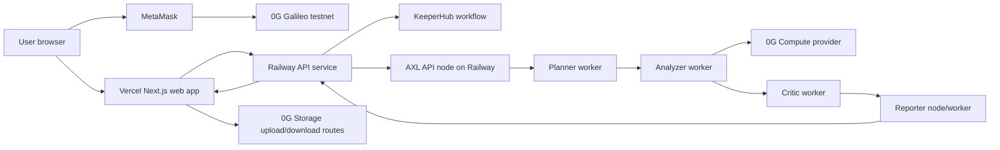
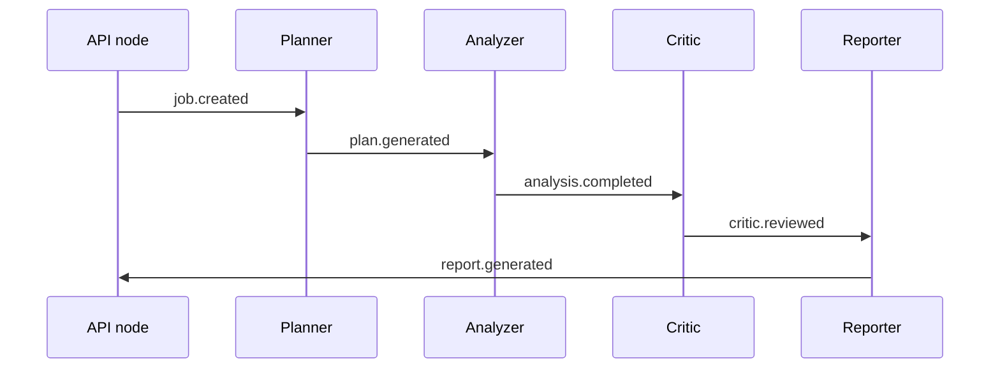
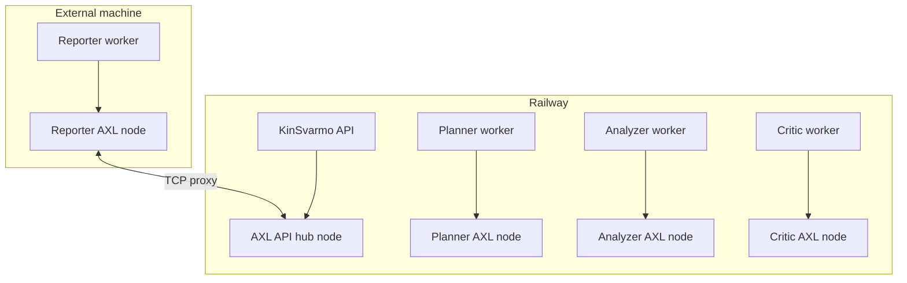
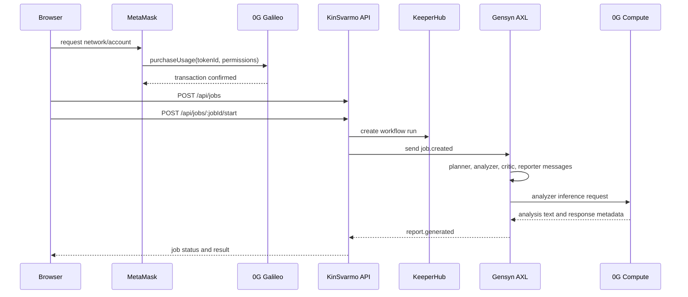

# KinSvarmo

KinSvarmo is an agent execution application for dataset analysis.

The application lets a user browse published analysis agents, authorize an agent run through a 0G testnet contract call, upload or reference a dataset, run a multi-agent workflow through Gensyn AXL, record the workflow start in KeeperHub, call 0G Compute for analysis, and view the final report with execution evidence.

The main use case is controlled access to reusable analysis agents. A creator can publish an agent with a domain, price, prompt, expected inputs, and storage references. A user can select that agent, authorize one run, submit a dataset, and receive a report with the workflow trail attached. The same structure can be used for phytochemistry, classroom assignments, research operations, legal document review, internal compliance checks, or any workflow where a dataset should be processed by a specific agent under an auditable execution path.

The project is not only a chat interface. The agent has a published identity, a usage authorization step, a dataset reference, a multi-agent execution route, and a final result object that can be inspected after the run.

## Entry Points

Landing page:

```text
https://kinsvarmoui.vercel.app/
```

Application:

```text
https://kinsvarmo-app.vercel.app
```

Documentation:

```text
https://kinsvarmo-docs.vercel.app/guide/getting-started.html
```

## What The Project Does

KinSvarmo separates an analysis run into five concerns:

1. Agent catalog and run authorization.
2. Dataset storage and metadata references.
3. Agent-to-agent execution.
4. External workflow audit.
5. Final report and proof display.

There are two primary product modes:

1. Marketplace mode: a user browses agents and runs one analysis directly.
2. Workspace mode: a coordinator creates a reusable work item around an agent, shares a submission page, and reviews submitted runs through the same job/result pipeline.

Workspace mode exists for repeated workflows. It is useful when multiple people need to submit datasets against the same agent and the coordinator needs a common place to track submissions, statuses, and result links. It is intentionally generic. It can represent a classroom assignment, a lab intake queue, an internal review process, or a benchmark collection.

The current production path is:

1. A user opens the web application.
2. The user selects an analysis agent.
3. The user connects MetaMask on 0G Galileo testnet.
4. The user authorizes one run of the selected agent through the iNFT registry contract.
5. The frontend creates an API job.
6. The API creates a KeeperHub workflow execution.
7. The API sends the job into Gensyn AXL.
8. Planner, analyzer, critic, and reporter agents exchange AXL messages.
9. The analyzer calls 0G Compute when compute credentials are configured.
10. The reporter returns the final report to the API.
11. The job status page shows AXL messages, KeeperHub state, 0G execution details, and the result JSON.

## System Diagram




## Technology Roles

### Next.js Web Application

Location: `apps/web`

The web app is the user interface. It provides:

- Agent marketplace pages.
- Agent detail pages.
- Wallet connection and 0G network switching.
- Agent run authorization.
- Dataset upload path.
- Job status page.
- Result page.
- Workplace flow for reusable assignment-style runs.

The Workplace flow is a thin coordination layer over the same job system. It does not introduce a second execution engine. Each submission still becomes a normal job, and the job still uses 0G authorization, KeeperHub tracking, AXL messaging, and the result page.

The production web deployment is intended to run on Vercel.

Current production URL:

```text
https://kinsvarmo-app.vercel.app
```

### API Service

Location: `apps/api`

The API service owns the backend job lifecycle. It provides:

- `POST /api/jobs`
- `POST /api/jobs/:jobId/start`
- `GET /api/jobs/:jobId`
- `GET /api/jobs/:jobId/messages`
- `GET /api/jobs/:jobId/result`
- `GET /api/jobs/:jobId/keeperhub`
- `GET /api/axl/topology`
- `GET /health`
- `GET /ready`

The API currently uses an in-memory job store. This is acceptable for the live demo because a running Railway instance preserves state while the process is alive. It is not durable storage. A process restart loses local jobs and locally created agents.

Production API URL:

```text
https://kingsvarmoapi-production.up.railway.app
```

### Gensyn AXL

Location:

- `packages/axl-client`
- `scripts/axl`

AXL is the agent communication layer. KinSvarmo uses it for inter-agent messages instead of calling all worker functions directly in one process.

The workflow participants are:

- `api`
- `planner`
- `analyzer`
- `critic`
- `reporter`

The normal message chain is:




The job page displays these as AXL messages.

Expected message count for a completed run:

```text
5 AXL messages
```

The raw endpoint is:

```bash
curl -s https://kingsvarmoapi-production.up.railway.app/api/jobs/JOB_ID/messages
```

### AXL Deployment Shape

Railway runs:

- API service.
- AXL API node.
- AXL planner node.
- AXL analyzer node.
- AXL critic node.
- Planner worker.
- Analyzer worker.
- Critic worker.

The reporter is intentionally allowed to run outside Railway. This proves that one workflow participant can be external while the run still completes over AXL.

Production AXL split:




Railway networking:

```text
HTTP public domain -> 8080
AXL TCP proxy -> 10101
```

The current AXL TCP proxy is:

```text
switchback.proxy.rlwy.net:58460
```

The AXL topology endpoint is:

```bash
curl -s https://kingsvarmoapi-production.up.railway.app/api/axl/topology
```

This endpoint proves which AXL nodes are reachable and which peer IDs are connected. It is not the same as the job message log.

### KeeperHub

Location:

- `packages/keeperhub`
- `scripts/keeperhub`

KeeperHub is used as an external workflow execution record. KinSvarmo creates a KeeperHub run when the backend starts an analysis job.

The KeeperHub workflow records:

- Job payload received.
- Payload validation.
- AXL dispatch audit.
- KeeperHub-side finalization.

KeeperHub is not the message bus. AXL carries the agent messages. KeeperHub is the independent workflow audit layer.

The UI shows KeeperHub data on the job status page:

- Execution ID.
- Workflow ID.
- Node statuses.
- Recent logs.
- Workflow trace.

Relevant API endpoint:

```bash
curl -s https://kingsvarmoapi-production.up.railway.app/api/jobs/JOB_ID/keeperhub
```

KeeperHub workflow creation script:

```bash
pnpm keeperhub:create-webhook
```

KeeperHub workflow test script:

```bash
pnpm keeperhub:test
```

### KeeperHub, AXL, and 0G Boundary

KeeperHub, AXL, and 0G do not replace each other in this application.

KeeperHub:

- Receives the backend job payload.
- Validates that the required job fields exist.
- Records that KinSvarmo is about to dispatch the job through AXL.
- Provides an external execution ID and node log list for the job page.

AXL:

- Carries the actual agent messages.
- Connects the API, planner, analyzer, critic, and reporter participants.
- Allows the reporter to run outside the hosted API service.
- Produces the five-message workflow trail shown in the job page.

0G:

- Handles the user wallet transaction.
- Stores or references agent and dataset metadata.
- Runs the configured compute provider for analysis.
- Provides the chain, storage, and compute evidence shown in the result.

The app links these systems at the job level. The job ID is the common reference used by the API, UI, KeeperHub run, AXL messages, and result object.

### 0G Chain

Location:

- `packages/contracts`
- `packages/zero-g`
- `apps/web/hooks/useINFTRegistry.ts`

0G Galileo testnet is used for the wallet and contract side of the agent run.

The current contract role:

- Store agent/iNFT metadata.
- Authorize usage through `purchaseUsage`.
- Provide a visible on-chain transaction before the backend execution starts.

The frontend asks MetaMask to use 0G Galileo testnet before starting the run. If the wallet is on another chain, the transaction is rejected.

Current registry address:

```text
0xD89CF7E93B95370a9c4DbCbeDD596eb36386ed86
```

Explorer:

```text
https://chainscan-galileo.0g.ai
```

### 0G Storage

Location:

- `packages/zero-g/src/storage.ts`
- `apps/web/app/api/0g/storage/upload/route.ts`
- `apps/web/app/api/0g/storage/download/route.ts`
- `apps/web/hooks/use0GStorage.ts`

0G Storage is used for dataset and metadata storage references.

The browser does not call the raw 0G storage endpoint directly in production. The web app routes uploads and downloads through Next.js API routes. This avoids mixed-content browser failures and keeps the storage write path server-side.

The app displays references in the form:

```text
0g://...
```

### 0G Compute

Location:

- `packages/zero-g/src/compute.ts`
- `scripts/axl/agent-worker.ts`

0G Compute is used by the analyzer worker when the compute provider, service URL, model, and API secret are configured.

The analyzer sends dataset context and agent instructions to the configured 0G Compute provider. The result object stores:

- Provider address.
- Model name.
- Service URL.
- Chat completion ID.
- Token usage when returned.
- Raw provider response.

The result page displays whether a run used real 0G Compute or a fallback path.

## Runtime Flow




## Repository Layout

```text
apps/
  api/          Fastify API service.
  web/          Next.js web app.
  contracts/    Contract workspace.

packages/
  agents/       Planner, analyzer, critic, reporter contracts and helpers.
  axl-client/   HTTP client for AXL node endpoints.
  contracts/    Shared contract artifacts and ABIs.
  keeperhub/    KeeperHub HTTP and in-memory clients.
  shared/       Shared job, agent, and message types.
  zero-g/       0G chain, storage, and compute helpers.

scripts/
  axl/          Local, real, and remote AXL node scripts.
  keeperhub/    KeeperHub workflow creation and test scripts.
  deploy/       Railway deployment helpers.
  demo/         Local demo helpers.
  tests/        Node test suite.
```

## Important URLs

Landing page:

```text
https://kinsvarmoui.vercel.app/
```

Documentation:

```text
https://kinsvarmo-docs.vercel.app/guide/getting-started.html
```

Production web:

```text
https://kinsvarmo-app.vercel.app
```

Production API:

```text
https://kingsvarmoapi-production.up.railway.app
```

Health check:

```bash
curl -s https://kingsvarmoapi-production.up.railway.app/health
```

Readiness check:

```bash
curl -s https://kingsvarmoapi-production.up.railway.app/ready
```

AXL topology:

```bash
curl -s https://kingsvarmoapi-production.up.railway.app/api/axl/topology
```

Job messages:

```bash
curl -s https://kingsvarmoapi-production.up.railway.app/api/jobs/JOB_ID/messages
```

Job result:

```bash
curl -s https://kingsvarmoapi-production.up.railway.app/api/jobs/JOB_ID/result
```

## Environment Variables

Do not commit real secrets.

### Web

Typical production values:

```env
NEXT_PUBLIC_API_URL=https://kingsvarmoapi-production.up.railway.app
NEXT_PUBLIC_CHAIN_ID=16602
NEXT_PUBLIC_INFT_REGISTRY_ADDRESS=0xD89CF7E93B95370a9c4DbCbeDD596eb36386ed86
NEXT_PUBLIC_0G_INFERENCE_PROVIDER=0xa48f01287233509FD694a22Bf840225062E67836
NEXT_PUBLIC_0G_INDEXER_RPC=https://indexer-storage-testnet-turbo.0g.ai
```

Server-side Vercel variables used by 0G storage routes:

```env
ZERO_G_RPC_URL=https://evmrpc-testnet.0g.ai
ZERO_G_STORAGE_ENDPOINT=https://indexer-storage-testnet-turbo.0g.ai
ZERO_G_PRIVATE_KEY=...
```

### API

Typical Railway values:

```env
NODE_ENV=production
HOST=0.0.0.0
API_PORT=8080
WEB_ORIGIN=https://kinsvarmo-app.vercel.app
CORS_ORIGINS=https://kinsvarmo-app.vercel.app

AXL_TRANSPORT=real
AXL_START_REAL_NODES=1
AXL_START_LOCAL_NODES=0
AXL_START_WORKERS=1
AXL_REAL_DIR=/opt/axl
AXL_REAL_PORT_OFFSET=1000
AXL_REAL_HUB_LISTEN_HOST=0.0.0.0
AXL_REAL_NODE_PARTICIPANTS=api,planner,analyzer,critic
AXL_WORKERS=planner,analyzer,critic
AXL_NODE_REPORTER_PEER_ID=...

KEEPERHUB_BASE_URL=https://app.keeperhub.com
KEEPERHUB_API_KEY=...
KEEPERHUB_WEBHOOK_KEY=...
KEEPERHUB_WORKFLOW_ID=...

ZERO_G_RPC_URL=https://evmrpc-testnet.0g.ai
ZERO_G_EXPLORER_URL=https://chainscan-galileo.0g.ai
ZERO_G_STORAGE_ENDPOINT=https://indexer-storage-testnet-turbo.0g.ai
ZERO_G_PRIVATE_KEY=...
ZERO_G_COMPUTE_PROVIDER_ADDRESS=...
ZERO_G_COMPUTE_SERVICE_URL=https://compute-network-6.integratenetwork.work
ZERO_G_COMPUTE_API_SECRET=...
ZERO_G_COMPUTE_MODEL=qwen/qwen-2.5-7b-instruct
```

Important Railway networking:

```text
HTTP domain target port: 8080
TCP proxy target port: 10101
```

Do not set the API HTTP server to `10101`. Port `10101` is used by the AXL hub when `AXL_REAL_PORT_OFFSET=1000`.

## Local Development

Install dependencies:

```bash
pnpm install
```

Run the local demo stack:

```bash
pnpm demo:local
```

Check the local demo stack:

```bash
pnpm demo:check
```

Run tests:

```bash
pnpm test
pnpm test:axl
pnpm typecheck
```

## Real AXL Reporter

The remote reporter is used to show that one workflow participant can run outside the Railway service.

Persistent local AXL directory:

```text
$HOME/.kingsvarmo-axl
```

The repo auto-installs the AXL node binary there if it is missing.

Terminal 1: start the reporter AXL node.

```bash
cd ~/open-agents-2026

nvm use 20 2>/dev/null || true
corepack enable

export NODE_ENV=production
export AXL_TRANSPORT=real
export AXL_REAL_DIR="$HOME/.kingsvarmo-axl"
export AXL_REAL_PORT_OFFSET=1000
export AXL_REMOTE_SEED_PEER="tls://switchback.proxy.rlwy.net:58460"
export AXL_REQUEST_TIMEOUT_MS=180000

pnpm axl:remote:reporter:node
```

Terminal 2: export the reporter environment and start the worker.

```bash
cd ~/open-agents-2026

export AXL_REAL_DIR="$HOME/.kingsvarmo-axl"
export AXL_REAL_PORT_OFFSET=1000
export AXL_REMOTE_API_PEER_ID="$(curl -s https://kingsvarmoapi-production.up.railway.app/api/axl/topology | node -e 'let s=\"\"; process.stdin.on(\"data\", d => s += d); process.stdin.on(\"end\", () => console.log(JSON.parse(s).nodes.find((node) => node.participant === \"api\").peerId));')"

pnpm axl:remote:reporter:env

set -a
source "$HOME/.kingsvarmo-axl/kingsvarmo-configs/kinsvarmo-remote-reporter.env"
set +a

pnpm axl:remote:reporter:worker
```

When the reporter key changes, the script prints:

```text
AXL_NODE_REPORTER_PEER_ID=...
```

Set that value in Railway and redeploy the API service.

## Production Verification

Check API health:

```bash
curl -s https://kingsvarmoapi-production.up.railway.app/health
```

Check configured dependencies:

```bash
curl -s https://kingsvarmoapi-production.up.railway.app/ready
```

Check AXL topology:

```bash
curl -s https://kingsvarmoapi-production.up.railway.app/api/axl/topology
```

Expected AXL topology:

- `api` reachable.
- `planner` reachable.
- `analyzer` reachable.
- `critic` reachable.
- `reporter` connected as a peer to the Railway AXL hub when the remote reporter node is running.

Run the UI flow:

1. Open `https://kinsvarmo-app.vercel.app/agents`.
2. Open an agent detail page.
3. Connect MetaMask.
4. Switch to 0G Galileo testnet.
5. Start an analysis.
6. Confirm the 0G transaction.
7. Open the job status page.
8. Confirm the job reaches `completed`.
9. Confirm the AXL message count is `5`.
10. Open the result page and inspect the structured JSON.

## What Is Stored Where

### Browser

The browser holds the connected wallet session and transient UI state.

### Vercel

Vercel serves the Next.js web app and the web-side API routes used for 0G storage upload/download.

### Railway

Railway runs the API process, real AXL nodes, and the hosted workers. The current backend job store is in memory. It is not a database.

### KeeperHub

KeeperHub stores an external workflow execution record for the job start and audit steps.

### 0G Chain

0G stores the on-chain contract state and usage authorization transaction.

### 0G Storage

0G Storage stores uploaded dataset and metadata content when the storage path is used.

### 0G Compute

0G Compute returns the inference response used by the analyzer worker. The app stores the response metadata in the job result object.

## Current Limitations

- The API job store is in memory.
- Railway process restarts remove in-memory jobs.
- The current build uses one external reporter machine for the distributed AXL proof.
- Some catalog agents are seeded examples.
- The production workflow depends on external service availability: 0G RPC, 0G Storage, 0G Compute, KeeperHub, Railway, Vercel, and the remote reporter process.
- The result is a demo scientific report. It should not be treated as a validated scientific conclusion.

## Useful Commands

Create KeeperHub workflow:

```bash
pnpm keeperhub:create-webhook
```

Test KeeperHub workflow:

```bash
pnpm keeperhub:test
```

Start local AXL-compatible nodes:

```bash
pnpm axl:nodes
```

Start local workers:

```bash
pnpm axl:workers
```

Run AXL demo:

```bash
pnpm axl:demo
```

Run typecheck:

```bash
pnpm typecheck
```

Run tests:

```bash
pnpm test
```
